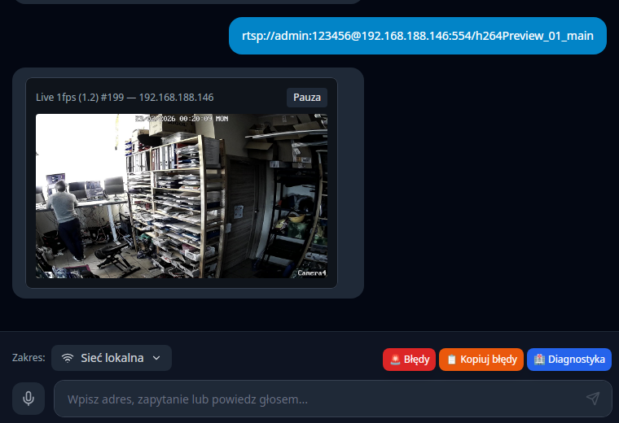

# ⚡ Broxeen v2.1 — AI Camera Monitoring & Network Discovery

Desktopowa aplikacja **Tauri 2 + React** do monitoringu kamer AI i odkrywania sieci z wbudowanym TTS (Text-to-Speech) i rozpoznawaniem mowy.

Zamiast tradycyjnej przeglądarki — wpiszesz lub **mówisz** zapytanie, dostajesz czysty content, który możesz **odsłuchać** przez głośnik. Nowa wersja dodaje **monitoring kamer AI** i **zaawansowane skanowanie sieci**.

## Wymagania

| Narzędzie | Wersja | Instalacja |
|-----------|--------|------------|
| Node.js | ≥ 18 | [nodejs.org](https://nodejs.org) |
| Rust + Cargo | ≥ 1.70 | `curl https://sh.rustup.rs -sSf \| sh` |
| npm | ≥ 9 | dołączony do Node.js |
| Linux: webkit2gtk | 4.1 | patrz niżej |

### Zależności systemowe (Linux)

```bash
sudo apt install -y \
  libwebkit2gtk-4.1-dev \
  libappindicator3-dev \
  librsvg2-dev \
  patchelf \
  libssl-dev \
  pkg-config
```

## Szybki start

```bash
# 1. Zainstaluj zależności Node
npm install

# 2. Uruchom w trybie development (hot reload)
make dev

# (opcjonalnie) Tylko frontend (Vite)
make dev-browser

# (opcjonalnie) Linux/Nvidia: obejścia dla WebKitGTK
make dev-nvidia

# 3. Build produkcyjny (.deb / .AppImage / .exe / .dmg)
make build
```

`make dev` uruchamia `tauri dev`, a Tauri automatycznie startuje Vite poprzez `beforeDevCommand` w `src-tauri/tauri.conf.json`.

### Przyspieszenie buildów (Rust + Tauri)
W repo dostajesz `.cargo/config.toml` przygotowany pod [`sccache`](https://github.com/mozilla/sccache) i profil `dev-release`.

1. Zainstaluj sccache (`cargo install sccache` lub z pakietów) i ustaw zmienne środowiskowe:
   ```bash
   export RUSTC_WRAPPER="sccache"
   export SCCACHE_DIR="$HOME/.cache/sccache"
   ```
2. Standardowe `npm run tauri build` automatycznie użyje cache (inkrementalne kompilacje).
3. Gdy potrzebujesz szybkiego, zoptymalizowanego buildu, uruchom:
   ```bash
   cargo tauri build --profile dev-release
   ```
   Profil dziedziczy z `release`, ale ma włączone debug info i incremental build, dzięki czemu rebuildy są dużo szybsze.

## Testy

```bash
# Uruchom wszystkie testy jednostkowe
npm test

# Tryb watch (re-run przy zmianach)
npm run test:watch

# Testy z raportem pokrycia kodu
npm run test:coverage
```

Aktualny wynik: **614 testów, 0 błędów**.

## Architektura

```
broxeen/
├── src-tauri/                  # Backend Rust (Tauri 2)
│   ├── Cargo.toml              # Zależności Rust
│   ├── tauri.conf.json         # Konfiguracja okna, CSP, bundle
│   ├── build.rs                # Tauri build script
│   ├── capabilities/
│   │   └── default.json        # Uprawnienia Tauri (core, shell)
│   ├── icons/                  # Ikony aplikacji (PNG, ICO, ICNS)
│   └── src/
│       └── main.rs             # Komendy Tauri: browse, get/save_settings
├── src/                        # Frontend React + TypeScript
│   ├── App.tsx                 # Główny komponent, ładowanie ustawień
│   ├── main.tsx                # React entry point
│   ├── index.css               # TailwindCSS base
│   ├── components/
│   │   ├── Chat.tsx            # Chat UI, obsługa wiadomości
│   │   ├── Settings.tsx        # Panel ustawień audio (modal)
│   │   └── TtsControls.tsx     # Przyciski play/pause/stop TTS
│   ├── hooks/
│   │   ├── useTts.ts           # Web Speech API — synteza mowy
│   │   └── useSpeech.ts        # Web Speech API — rozpoznawanie mowy
│   ├── lib/
│   │   ├── phonetic.ts         # Normalizacja fonetyczna PL → URL
│   │   └── resolver.ts         # Pipeline rozwiązywania URL (5 kroków)
│   └── test/
│       └── setup.ts            # Vitest setup (mocki Speech API, Tauri)
├── src/lib/phonetic.test.ts        # 42 testy normalizacji fonetycznej
├── src/lib/resolver.test.ts        # 19 testów pipeline URL
├── src/hooks/useTts.test.ts        # 13 testów hooka TTS
├── src/hooks/useSpeech.test.ts     # 12 testów hooka mikrofonu
├── src/components/TtsControls.test.tsx  # 9 testów komponentu TTS
├── src/components/Chat.test.tsx         # 16 testów komponentu Chat
├── src/components/Settings.test.tsx     # 19 testów panelu ustawień
├── index.html                  # Vite HTML entry
├── package.json                # Skrypty npm + zależności
├── vite.config.ts              # Vite + Vitest konfiguracja
├── tsconfig.json               # TypeScript (wyklucza pliki testowe)
├── tsconfig.test.json          # TypeScript dla testów (vitest globals)
├── tailwind.config.js
└── postcss.config.js
```

## Tauri Commands (backend Rust)

| Komenda | Parametry | Opis |
|---------|-----------|------|
| `browse` | `url: string` | Pobiera stronę i ekstrahuje tekst |
| `get_settings` | — | Wczytuje ustawienia z `~/.config/broxeen/settings.json` |
| `save_settings` | `settings: AudioSettings` | Zapisuje ustawienia audio |
| `rtsp_capture_frame` | `url: string`, `camera_id: string` | Zrzuca pojedynczą klatkę z RTSP (JPEG base64). Zwraca też `frame_age_ms` i `frame_count` jako metryki |
| `rtsp_worker_stats` | — | Zwraca statystyki wszystkich aktywnych workerów RTSP (camera_id, url, frame_count, uptime_ms, last_error) |
| `db_execute` | `db_path: string`, `sql: string`, `params: any[]` | Wykonuje SQL (gdy `params` puste, obsługuje multi-statement przez `execute_batch`) |
| `db_query` | `db_path: string`, `sql: string`, `params: any[]` | Zapytania SELECT do SQLite |
| `db_close` | `db_path: string` | Zamknięcie połączenia do SQLite |

## Interaktywny UX

### Ekran powitalny
Po uruchomieniu użytkownik widzi **6 klikalnych kart akcji**:
| Akcja | Opis | Tryb |
|-------|------|------|
| 🔍 Skanuj sieć | Znajdź urządzenia w LAN | execute |
| 📷 Znajdź kamery | Odkryj kamery IP | execute |
| 🌍 Przeglądaj stronę | Otwórz dowolny URL | prefill |
| ⚙️ Konfiguracja | Ustaw AI, sieć, SSH | execute |
| 👁️ Monitoruj | Obserwuj zmiany | prefill |
| ❓ Pomoc | Co mogę zrobić? | execute |

### Kontekstowe akcje na wiadomościach
Każda odpowiedź asystenta automatycznie otrzymuje **przyciski szybkich akcji** na dole wiadomości, dopasowane do treści:

| Kontekst wiadomości | Generowane akcje |
|---------------------|-----------------|
| Wynik skanowania sieci + IP | Ping, Porty, Skanuj ponownie |
| Znaleziona kamera + IP | ▶ Live, Snapshot, Monitoruj |
| Wynik ping + IP | Skanuj porty, SSH |
| Wynik skanowania portów (22, 80, 443) | SSH, Otwórz w przeglądarce, Monitoruj |
| Wynik SSH | Dyski (df -h), Procesy (top) |
| Monitoring aktywny | Logi, Aktywne monitoringi |
| Przeglądanie strony | Odśwież, Szukaj więcej |

Trzy tryby akcji: **execute** (natychmiastowe wykonanie), **prefill** (wstaw do inputa), **link** (otwórz URL).

## Pipeline rozwiązywania URL

```
Input użytkownika
    │
    ├─→ "https://google.com"      → [exact]     bezpośredni URL
    ├─→ "onet.pl"                 → [exact]     bare domain + https://
    ├─→ "onet kropka pe el"       → [fuzzy]     phonetic → onet.pl
    ├─→ "facbook"                 → [fuzzy]     Levenshtein → facebook.com
    ├─→ "facbok"                  → [ambiguous] sugestie do wyboru
    └─→ "restauracje w Gdańsku"   → [search]    DuckDuckGo fallback
```

### Normalizacja fonetyczna (30+ reguł)

| Mówione | Wynik |
|---------|-------|
| `onet kropka pe el` | `onet.pl` |
| `github kropka kom` | `github.com` |
| `trzy w kropka wp kropka pe el` | `www.wp.pl` |
| `user małpa gmail kropka kom` | `user@gmail.com` |
| `ha te te pe es` | `https` |

## Ustawienia audio

Ustawienia zapisywane w `~/.config/broxeen/settings.json`:

| Parametr | Domyślnie | Opis |
|----------|-----------|------|
| `tts_enabled` | `true` | Włącz/wyłącz TTS |
| `tts_rate` | `1.0` | Szybkość mowy (0.5–2.0) |
| `tts_pitch` | `1.0` | Ton głosu (0.5–2.0) |
| `tts_volume` | `1.0` | Głośność (0–1) |
| `tts_voice` | `""` | Głos (domyślnie: pierwszy polski) |
| `tts_lang` | `pl-PL` | Język TTS i rozpoznawania mowy |
| `mic_enabled` | `true` | Włącz mikrofon |
| `mic_device_id` | `default` | ID urządzenia wejściowego |
| `speaker_device_id` | `default` | ID urządzenia wyjściowego |
| `auto_listen` | `false` | Auto-nasłuchiwanie po odpowiedzi |

## Rozwiązywanie problemów

| Problem | Rozwiązanie |
|---------|-------------|
| `npm: command not found` | Użyj pełnej ścieżki: `PATH="/usr/share/nodejs/corepack/shims:$PATH" npm install` |
| `tauri dev` czeka na frontend | Upewnij się, że w `src-tauri/tauri.conf.json` jest `beforeDevCommand` i uruchamiaj przez `make dev` |
| `Port 5173 is already in use` | Uruchom `make stop-all` i ponownie `make dev` (Makefile czyści port 5173 przed startem) |
| Brak ikon przy `cargo check` | Uruchom `npm run tauri dev` — ikony są w `src-tauri/icons/` |
| TTS nie działa | Sprawdź czy przeglądarka/WebView obsługuje `speechSynthesis`; na Linux wymagany `espeak` lub głosy systemowe |
| Mikrofon nie działa | Aplikacja prosi o uprawnienia przy starcie; sprawdź ustawienia systemowe |
| `libwebkit2gtk` brak | `sudo apt install libwebkit2gtk-4.1-dev` |
| Live RTSP nie działa / brak klatki | Upewnij się, że w systemie jest dostępne `ffmpeg`. Live RTSP w Tauri używa long-lived worker/cache (ffmpeg uruchamiany w tle per kamera/url) i zwraca ostatnią klatkę. Niektóre buildy ffmpeg nie wspierają flag timeout (`-stimeout`, `-rw_timeout`) — w razie potrzeby usuń te flagi lub użyj builda z pełnym wsparciem |

Diagnostyka i raport błędów są dostępne z pływających przycisków po prawej stronie — nad selektorem zakresu (scope).

## License

Apache License 2.0 - see [LICENSE](LICENSE) for details.

## Author

Created by **Tom Sapletta** - [tom@sapletta.com](mailto:tom@sapletta.com)
