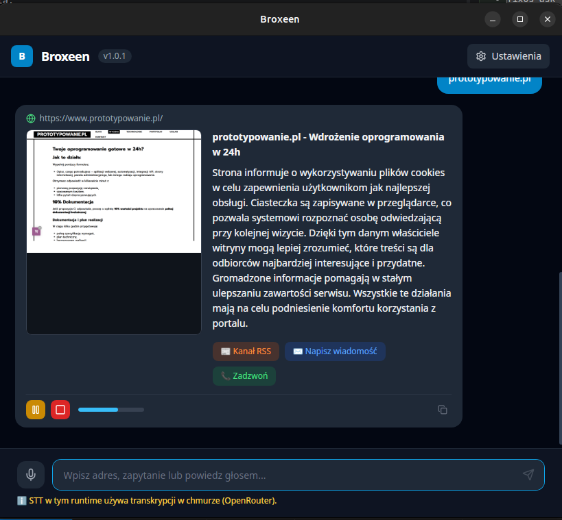

# ⚡ Broxeen — Przeglądaj Internet przez Chat z TTS

Desktopowa aplikacja **Tauri 2 + React** do przeglądania internetu przez chat z wbudowanym TTS (Text-to-Speech) i rozpoznawaniem mowy.

Zamiast tradycyjnej przeglądarki — wpisujesz lub **mówisz** zapytanie, dostajesz czysty content, który możesz **odsłuchać** przez głośnik.

## Wymagania

| Narzędzie | Wersja | Instalacja |
|-----------|--------|------------|
| Node.js | ≥ 18 | [nodejs.org](https://nodejs.org) |
| Rust + Cargo | ≥ 1.70 | `curl https://sh.rustup.rs -sSf \| sh` |
| npm | ≥ 9 | dołączony do Node.js |
| Linux: webkit2gtk | 4.1 | patrz niżej |

### Zależności systemowe (Linux)

```bash
sudo apt install -y \
  libwebkit2gtk-4.1-dev \
  libappindicator3-dev \
  librsvg2-dev \
  patchelf \
  libssl-dev \
  pkg-config
```

## Szybki start

```bash
# 1. Zainstaluj zależności Node
npm install

# 2. Uruchom w trybie development (hot reload)
npm run tauri dev

# 3. Build produkcyjny (.deb / .AppImage / .exe / .dmg)
npm run tauri build
```

## Testy

```bash
# Uruchom wszystkie testy jednostkowe
npm test

# Tryb watch (re-run przy zmianach)
npm run test:watch

# Testy z raportem pokrycia kodu
npm run test:coverage
```

Aktualny wynik: **130 testów, 0 błędów** (phonetic: 42, resolver: 19, useTts: 13, useSpeech: 12, TtsControls: 9, Chat: 16, Settings: 19).

## Architektura

```
broxeen/
├── src-tauri/                  # Backend Rust (Tauri 2)
│   ├── Cargo.toml              # Zależności Rust
│   ├── tauri.conf.json         # Konfiguracja okna, CSP, bundle
│   ├── build.rs                # Tauri build script
│   ├── capabilities/
│   │   └── default.json        # Uprawnienia Tauri (core, shell)
│   ├── icons/                  # Ikony aplikacji (PNG, ICO, ICNS)
│   └── src/
│       └── main.rs             # Komendy Tauri: browse, get/save_settings
├── src/                        # Frontend React + TypeScript
│   ├── App.tsx                 # Główny komponent, ładowanie ustawień
│   ├── main.tsx                # React entry point
│   ├── index.css               # TailwindCSS base
│   ├── components/
│   │   ├── Chat.tsx            # Chat UI, obsługa wiadomości
│   │   ├── Settings.tsx        # Panel ustawień audio (modal)
│   │   └── TtsControls.tsx     # Przyciski play/pause/stop TTS
│   ├── hooks/
│   │   ├── useTts.ts           # Web Speech API — synteza mowy
│   │   └── useSpeech.ts        # Web Speech API — rozpoznawanie mowy
│   ├── lib/
│   │   ├── phonetic.ts         # Normalizacja fonetyczna PL → URL
│   │   └── resolver.ts         # Pipeline rozwiązywania URL (5 kroków)
│   └── test/
│       └── setup.ts            # Vitest setup (mocki Speech API, Tauri)
├── src/lib/phonetic.test.ts        # 42 testy normalizacji fonetycznej
├── src/lib/resolver.test.ts        # 19 testów pipeline URL
├── src/hooks/useTts.test.ts        # 13 testów hooka TTS
├── src/hooks/useSpeech.test.ts     # 12 testów hooka mikrofonu
├── src/components/TtsControls.test.tsx  # 9 testów komponentu TTS
├── src/components/Chat.test.tsx         # 16 testów komponentu Chat
├── src/components/Settings.test.tsx     # 19 testów panelu ustawień
├── index.html                  # Vite HTML entry
├── package.json                # Skrypty npm + zależności
├── vite.config.ts              # Vite + Vitest konfiguracja
├── tsconfig.json               # TypeScript (wyklucza pliki testowe)
├── tsconfig.test.json          # TypeScript dla testów (vitest globals)
├── tailwind.config.js
└── postcss.config.js
```

## Tauri Commands (backend Rust)

| Komenda | Parametry | Opis |
|---------|-----------|------|
| `browse` | `url: string` | Pobiera stronę i ekstrahuje tekst |
| `get_settings` | — | Wczytuje ustawienia z `~/.config/broxeen/settings.json` |
| `save_settings` | `settings: AudioSettings` | Zapisuje ustawienia audio |

## Pipeline rozwiązywania URL

```
Input użytkownika
    │
    ├─→ "https://google.com"      → [exact]     bezpośredni URL
    ├─→ "onet.pl"                 → [exact]     bare domain + https://
    ├─→ "onet kropka pe el"       → [fuzzy]     phonetic → onet.pl
    ├─→ "facbook"                 → [fuzzy]     Levenshtein → facebook.com
    ├─→ "facbok"                  → [ambiguous] sugestie do wyboru
    └─→ "restauracje w Gdańsku"   → [search]    DuckDuckGo fallback
```

### Normalizacja fonetyczna (30+ reguł)

| Mówione | Wynik |
|---------|-------|
| `onet kropka pe el` | `onet.pl` |
| `github kropka kom` | `github.com` |
| `trzy w kropka wp kropka pe el` | `www.wp.pl` |
| `user małpa gmail kropka kom` | `user@gmail.com` |
| `ha te te pe es` | `https` |

## Ustawienia audio

Ustawienia zapisywane w `~/.config/broxeen/settings.json`:

| Parametr | Domyślnie | Opis |
|----------|-----------|------|
| `tts_enabled` | `true` | Włącz/wyłącz TTS |
| `tts_rate` | `1.0` | Szybkość mowy (0.5–2.0) |
| `tts_pitch` | `1.0` | Ton głosu (0.5–2.0) |
| `tts_volume` | `1.0` | Głośność (0–1) |
| `tts_voice` | `""` | Głos (domyślnie: pierwszy polski) |
| `tts_lang` | `pl-PL` | Język TTS i rozpoznawania mowy |
| `mic_enabled` | `true` | Włącz mikrofon |
| `mic_device_id` | `default` | ID urządzenia wejściowego |
| `speaker_device_id` | `default` | ID urządzenia wyjściowego |
| `auto_listen` | `false` | Auto-nasłuchiwanie po odpowiedzi |

## Rozwiązywanie problemów

| Problem | Rozwiązanie |
|---------|-------------|
| `npm: command not found` | Użyj pełnej ścieżki: `PATH="/usr/share/nodejs/corepack/shims:$PATH" npm install` |
| Brak ikon przy `cargo check` | Uruchom `npm run tauri dev` — ikony są w `src-tauri/icons/` |
| TTS nie działa | Sprawdź czy przeglądarka/WebView obsługuje `speechSynthesis`; na Linux wymagany `espeak` lub głosy systemowe |
| Mikrofon nie działa | Aplikacja prosi o uprawnienia przy starcie; sprawdź ustawienia systemowe |
| `libwebkit2gtk` brak | `sudo apt install libwebkit2gtk-4.1-dev` |

## License

Apache License 2.0 - see [LICENSE](LICENSE) for details.

## Author

Created by **Tom Sapletta** - [tom@sapletta.com](mailto:tom@sapletta.com)
