# System Architecture Analysis

## Overview

- **Project**: /home/tom/github/wronai/broxeen
- **Analysis Mode**: static
- **Total Functions**: 25
- **Total Classes**: 4
- **Modules**: 2
- **Entry Points**: 16

## Architecture by Module

### scripts.motion_pipeline
- **Functions**: 23
- **Classes**: 3
- **File**: `motion_pipeline.py`

### resolver
- **Functions**: 2
- **Classes**: 1
- **File**: `resolver.py`

## Key Entry Points

Main execution flows into the system:

### scripts.motion_pipeline.MotionPipeline.run
- **Calls**: cv2.VideoCapture, log.info, self._emit_event, cap.isOpened, log.error, sys.exit, cap.release, scripts.motion_pipeline.get_statistics

### resolver.resolve
> Resolve user input into a browseable URL.

Args:
    raw_input: Raw text from keyboard or speech recognition.
    threshold: Fuzzy matching threshold.
- **Calls**: raw_input.strip, re.match, re.match, normalize, looks_like_url, resolver.fuzzy_match_domain, ResolveResult, ResolveResult

### scripts.motion_pipeline.MotionPipeline.process_frame
- **Calls**: scripts.motion_pipeline.extract_moving_objects, self.classifier.classify, self._is_in_cooldown, self._update_cooldown, scripts.motion_pipeline.save_detection, scripts.motion_pipeline.should_send_to_llm, self._emit_event, round

### scripts.motion_pipeline.LocalClassifier.classify
> Returns (label, confidence, resized_crop).
- **Calls**: max, cv2.resize, self.model, max, int, float, self.model.names.get, YOLO_TO_10_CLASSES.get

### scripts.motion_pipeline.LlmVerifier.verify
> Returns (llm_label, description). Falls back to (local_label, '') on error.
- **Calls**: self._crop_to_b64, requests.post, resp.raise_for_status, None.strip, text.split, None.lower, None.strip, log.warning

### scripts.motion_pipeline.LlmVerifier._crop_to_b64
- **Calls**: cv2.imencode, None.decode, max, cv2.resize, max, base64.b64encode, int, int

### scripts.motion_pipeline.MotionPipeline.__init__
- **Calls**: scripts.motion_pipeline.init_db, scripts.motion_pipeline.create_bg_subtractor, LocalClassifier, LlmVerifier, time.time, os.environ.get, os.environ.get

### scripts.motion_pipeline.main
- **Calls**: scripts.motion_pipeline.parse_args, MotionPipeline, signal.signal, signal.signal, pipeline.run, log.setLevel, log.info

### scripts.motion_pipeline.LocalClassifier._load_model
- **Calls**: log.warning, self._select_model_path, YOLO, log.info, log.warning

### scripts.motion_pipeline.MotionPipeline._maybe_emit_stats
- **Calls**: time.time, scripts.motion_pipeline.get_statistics, self._emit_event

### scripts.motion_pipeline.LocalClassifier._select_model_path
- **Calls**: os.path.isdir, os.path.isfile

### scripts.motion_pipeline.MotionPipeline._is_in_cooldown
- **Calls**: time.time, self.last_seen.get

### scripts.motion_pipeline.MotionPipeline._emit_event
- **Calls**: print, json.dumps

### scripts.motion_pipeline.LocalClassifier.__init__
- **Calls**: self._load_model

### scripts.motion_pipeline.MotionPipeline._update_cooldown
- **Calls**: time.time

### scripts.motion_pipeline.LlmVerifier.__init__

## Process Flows

Key execution flows identified:

### Flow 1: run
```
run [scripts.motion_pipeline.MotionPipeline]
```

### Flow 2: resolve
```
resolve [resolver]
```

### Flow 3: process_frame
```
process_frame [scripts.motion_pipeline.MotionPipeline]
  └─ →> extract_moving_objects
  └─ →> save_detection
```

### Flow 4: classify
```
classify [scripts.motion_pipeline.LocalClassifier]
```

### Flow 5: verify
```
verify [scripts.motion_pipeline.LlmVerifier]
```

### Flow 6: _crop_to_b64
```
_crop_to_b64 [scripts.motion_pipeline.LlmVerifier]
```

### Flow 7: __init__
```
__init__ [scripts.motion_pipeline.MotionPipeline]
  └─ →> init_db
  └─ →> create_bg_subtractor
```

### Flow 8: main
```
main [scripts.motion_pipeline]
  └─> parse_args
```

### Flow 9: _load_model
```
_load_model [scripts.motion_pipeline.LocalClassifier]
```

### Flow 10: _maybe_emit_stats
```
_maybe_emit_stats [scripts.motion_pipeline.MotionPipeline]
  └─ →> get_statistics
```

## Key Classes

### scripts.motion_pipeline.MotionPipeline
- **Methods**: 7
- **Key Methods**: scripts.motion_pipeline.MotionPipeline.__init__, scripts.motion_pipeline.MotionPipeline._is_in_cooldown, scripts.motion_pipeline.MotionPipeline._update_cooldown, scripts.motion_pipeline.MotionPipeline._emit_event, scripts.motion_pipeline.MotionPipeline._maybe_emit_stats, scripts.motion_pipeline.MotionPipeline.process_frame, scripts.motion_pipeline.MotionPipeline.run

### scripts.motion_pipeline.LocalClassifier
- **Methods**: 4
- **Key Methods**: scripts.motion_pipeline.LocalClassifier.__init__, scripts.motion_pipeline.LocalClassifier._load_model, scripts.motion_pipeline.LocalClassifier._select_model_path, scripts.motion_pipeline.LocalClassifier.classify

### scripts.motion_pipeline.LlmVerifier
- **Methods**: 3
- **Key Methods**: scripts.motion_pipeline.LlmVerifier.__init__, scripts.motion_pipeline.LlmVerifier._crop_to_b64, scripts.motion_pipeline.LlmVerifier.verify

### resolver.ResolveResult
> Result of URL resolution.
- **Methods**: 0

## Data Transformation Functions

Key functions that process and transform data:

### scripts.motion_pipeline.MotionPipeline.process_frame
- **Output to**: scripts.motion_pipeline.extract_moving_objects, self.classifier.classify, self._is_in_cooldown, self._update_cooldown, scripts.motion_pipeline.save_detection

### scripts.motion_pipeline.parse_args
- **Output to**: argparse.ArgumentParser, p.add_argument, p.add_argument, p.add_argument, p.add_argument

## Public API Surface

Functions exposed as public API (no underscore prefix):

- `scripts.motion_pipeline.parse_args` - 20 calls
- `scripts.motion_pipeline.MotionPipeline.run` - 18 calls
- `scripts.motion_pipeline.extract_moving_objects` - 17 calls
- `scripts.motion_pipeline.save_detection` - 16 calls
- `resolver.resolve` - 15 calls
- `scripts.motion_pipeline.MotionPipeline.process_frame` - 14 calls
- `scripts.motion_pipeline.get_statistics` - 12 calls
- `scripts.motion_pipeline.LocalClassifier.classify` - 12 calls
- `scripts.motion_pipeline.LlmVerifier.verify` - 11 calls
- `resolver.fuzzy_match_domain` - 8 calls
- `scripts.motion_pipeline.init_db` - 7 calls
- `scripts.motion_pipeline.main` - 7 calls
- `scripts.motion_pipeline.update_detection_llm` - 2 calls
- `scripts.motion_pipeline.create_bg_subtractor` - 1 calls
- `scripts.motion_pipeline.should_send_to_llm` - 0 calls

## System Interactions

How components interact:

```mermaid
graph TD
    run --> VideoCapture
    run --> info
    run --> _emit_event
    run --> isOpened
    run --> error
    resolve --> strip
    resolve --> match
    resolve --> normalize
    resolve --> looks_like_url
    process_frame --> extract_moving_objec
    process_frame --> classify
    process_frame --> _is_in_cooldown
    process_frame --> _update_cooldown
    process_frame --> save_detection
    classify --> max
    classify --> resize
    classify --> model
    classify --> int
    verify --> _crop_to_b64
    verify --> post
    verify --> raise_for_status
    verify --> strip
    verify --> split
    _crop_to_b64 --> imencode
    _crop_to_b64 --> decode
    _crop_to_b64 --> max
    _crop_to_b64 --> resize
    __init__ --> init_db
    __init__ --> create_bg_subtractor
    __init__ --> LocalClassifier
```



## Reverse Engineering Guidelines

1. **Entry Points**: Start analysis from the entry points listed above
2. **Core Logic**: Focus on classes with many methods
3. **Data Flow**: Follow data transformation functions
4. **Process Flows**: Use the flow diagrams for execution paths
5. **API Surface**: Public API functions reveal the interface

## Context for LLM

Maintain the identified architectural patterns and public API surface when suggesting changes.